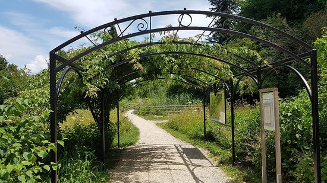

# Project 0

Web Programming with Python and JavaScript

Dear Professor, Dear teaching assistant,

In order to fulfill project 0 requirements, I have developed 4 html pages featuring locations close to where I live. I focused my efforts on fulfilling the requirements, therefore these pages do not provide the information these locations deserve.

## Project 0 structure:
- Four (4) html pages:
  - Yverdon-les-Bains.html
  - Champ_Pittet.html
  - Grandson.html
  - Yvonand.html
- One (1) css file :
  - style.css
- Tree (3) scss files and their related css and css.map files:
  - section_format.scss
  - img_table.scss
  - h1_h2_h3_formats.scss
- One folder containing the images:
  - pics

## Project 0 requirements walkthrough:
### Your website must contain at least four different .html pages, and it should be possible to get from any page on your website to any other page by following one or more hyperlinks.
- Four html pages developed
- Each html page ends with four hyperlinks, one for each of the 4 pages.

### Your website must include at least one list (ordered or unordered), at least one table, and at least one image.
##### the page Yverdon-les-Bains.html contrains: 
- an unordered list (starting line 38):
```
    <ul>
      <li>Lausanne</li>
      <li>Neuchâtel</li>
      <li>Geneva</li>
      <li>Balel</li>
      <li>Zurich</li>
    </ul>
```
- a table (starting line 50):
```
    <table>
      <tr>
	<th>Location</th>
	<th>distance in Km</th>
	<th>link to web page</th>
      </tr>
      .......
	  .......
    </table>
 ```
- All four pages contain images.

### Your website must have at least one stylesheet file.
- style.css

## Your stylesheet(s) must use at least five different CSS properties, and at least five different types of CSS selectors. You must use the #id selector at least once, and the .class selector at least once.
### at least five different CSS properties:
- there are plenty, for example line 4 to line 8 of style.css file:
### at least five different types of CSS selectors:
- please refer to lines 11 to 31 of style.css 
### the #id selector at least once, and the .class selector at least once:
- check style.css line 31 for #id selector ( used in Champ_Pittet.html line 26)
 ```
#natural_reserve {
  color: green;
  margin-left: 10%;
  margin-right: 10%;
}
 ```
- check section_formats.scss / section_formats.css for .class selectors and the html file Yverdon-les-Bains.html line 30 as a use case.

### Your stylesheet(s) must include at least one mobile-responsive @media query, such that something about the styling changes for smaller screens.
- check style.css line 43, use case in Grandson.html line 32. When the width of the window goes below 700 pix, the margins of the embedded google map disappears.

### You must use Bootstrap 4 on your website, taking advantage of at least one Bootstrap component, and using at least two Bootstrap columns for layout purposes using Bootstrap’s grid model.
- all html pages use Bootstrp's grid model to organize the images, here is an example from Champ_Pittet.html starting line 15:
 ```
  <div class="container">
    <div class="row">
      <div class="col-sm">
        
      </div>
      <div class="col-sm">
        
      </div>
    </div>
  </div>
 ```
  
- on the same page we have also used the "alert buttons" of Bootstrp, line 35:
    <div class="alert alert-success" role="alert">
    Meet some local residents:
  </div>
  
### Your stylesheets must use at least one SCSS variable, at least one example of SCSS nesting, and at least one use of SCSS inheritance.
- there are 3 scss pages
  - section_format.scss
  - img_table.scss
  - h1_h2_h3_formats.scss
- img_table_formats.scss uses scss nesting
- section_format.scss uses scss inheritance

  


